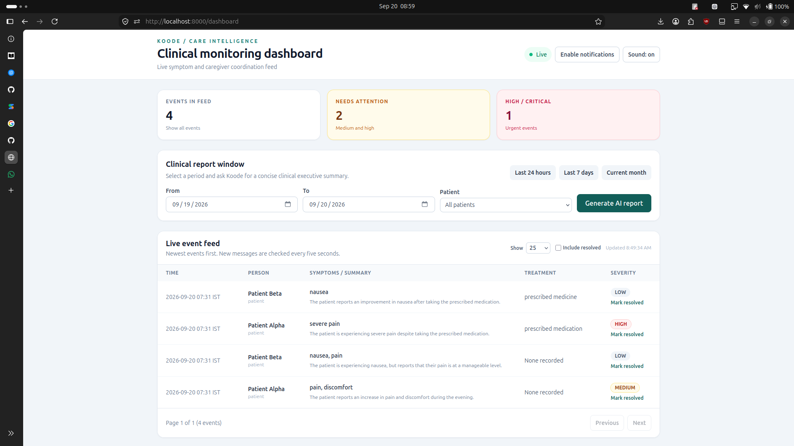
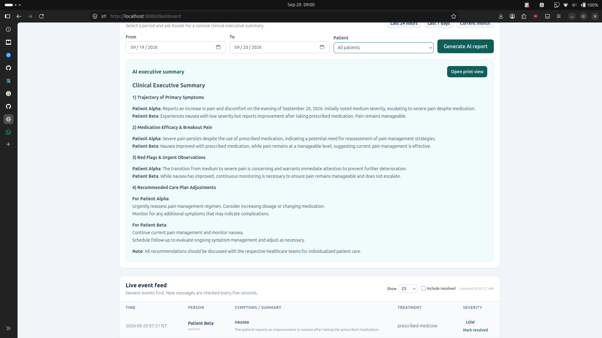
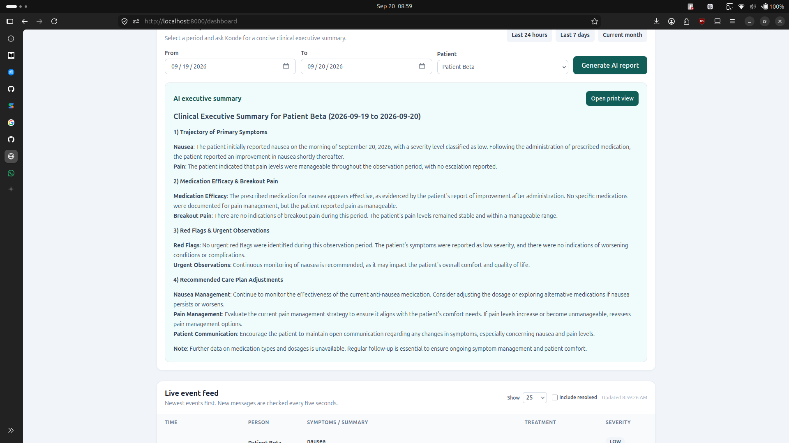

# Koode

## Overview

Koode is a compassionate WhatsApp-based palliative-care platform for symptom tracking, patient comfort, and caregiver coordination. It receives natural-language messages, translates them into structured clinical events, stores them in SQLite, responds empathetically, and gives care teams a live monitoring dashboard and printable clinical reports.

## Problem Statement

Patients and caregivers often communicate symptoms through informal, multilingual, and incomplete messages. Care teams need a reliable way to capture those updates, identify urgent concerns, understand symptom trends, and coordinate follow-up without adding burden to the patient or caregiver.

## Solution

Koode connects Twilio WhatsApp messages to an OpenAI clinical extraction layer. Each message is classified as a patient or caregiver update, translated into formal clinical English, assigned a severity level, and saved as a timeline event. The dashboard highlights active concerns, supports patient and severity filters, allows issues to be resolved or reopened, and generates date-filtered AI summaries that can be printed as PDF reports.

## Features

* Multilingual and casual-language WhatsApp message intake
* Empathetic patient and caregiver replies through Twilio TwiML
* OpenAI Structured Outputs for clinical event extraction
* Patient, severity, date-range, pagination, and resolved-status filters
* Live dashboard polling with browser notifications and synthesized alert sounds
* Interactive Events in feed, Needs attention, and High / critical views
* Mark resolved and reopen workflow for individual issues
* AI clinical executive summaries with Markdown rendering
* IST timestamps for dashboard and printable reports
* A4 print view containing only the selected date-range events
* Safe deterministic fallback mode when OpenAI is unavailable

## Tech Stack

* *Frontend:* Jinja2 templates, Tailwind CSS CDN, vanilla JavaScript, Web Audio API, Notification API
* *Backend:* Python, FastAPI, Uvicorn
* *Database:* SQLite with SQLAlchemy
* *APIs / Services:* OpenAI API, Twilio WhatsApp Sandbox API
* *Hosting / Deployment:* Local Uvicorn server with ngrok for webhook exposure; deployable to any Python ASGI host
* *Other Tools:* Pydantic, Jinja2, Git, browser print-to-PDF

## Codex / OpenAI Usage

OpenAI APIs power Koode's clinical workflows. Structured Outputs are used to extract `user_type`, translated clinical summaries, symptoms, severity, medications, and empathetic WhatsApp replies. A separate OpenAI prompt generates date-filtered clinical executive summaries.

Codex and ChatGPT were used during the hackathon for:

* Ideation and compassionate-care workflow design
* FastAPI, SQLAlchemy, Twilio, and OpenAI architecture planning
* Code generation for the webhook, AI extraction, dashboard, filters, and reports
* Debugging webhook form-field and date/timezone issues
* Testing with TestClient and curl
* Documentation and local setup instructions
* UI/UX development for the responsive monitoring dashboard

AI helped turn unstructured WhatsApp messages into a working care coordination prototype while keeping a human-review and safety-oriented workflow.

## Demo

### Live Demo

[Open the Koode demo](https://drive.google.com/file/d/1HNfXYDBg8Vw0pVd34JYCXzI0oiZt0JST/view?usp=sharing)

### Demo / Pitch Video

Add your demo or pitch video link here.

*A short demo/pitch video is strongly recommended. Show the WhatsApp message flow, dashboard alerts, patient filtering, resolved workflow, and AI report export.*

## Screenshots

### Koode Monitoring Dashboard



### All Patients AI Summary



### Patient-Specific AI Summary



## How to Run Locally

Requirements: Python 3.10+ and a Twilio account with WhatsApp Sandbox access.

```bash
git clone <repo-url>
cd <project-folder>
python -m venv .venv
source .venv/bin/activate
pip install -r requirements.txt
cp .env.example .env
uvicorn main:app --reload --host 0.0.0.0 --port 8000
```

On Windows, activate the environment with `.venv\Scripts\activate`. Koode loads configuration automatically from `.env`:

```env
OPENAI_API_KEY=your-openai-api-key
OPENAI_MODEL=gpt-4o-mini
TWILIO_AUTH_TOKEN=your-twilio-auth-token
DATABASE_URL=sqlite:///./koode.db
```

Open the dashboard at `http://localhost:8000/dashboard`. For WhatsApp testing, run `ngrok http 8000` and configure the Twilio Sandbox webhook as:

```text
https://YOUR-NGROK-DOMAIN.ngrok-free.app/webhook/whatsapp
```

You can test without Twilio:

```bash
curl -X POST http://localhost:8000/webhook/whatsapp \
  -H "Content-Type: application/x-www-form-urlencoded" \
  --data-urlencode "From=whatsapp:+15551234567" \
  --data-urlencode "ProfileName=Demo Patient" \
  --data-urlencode "Body=I feel tired today"
```

## Additional Notes

Koode not a qualified clinician. The AI is instructed not to diagnose or invent medication, and urgent messages should still be reviewed by a human care team.
